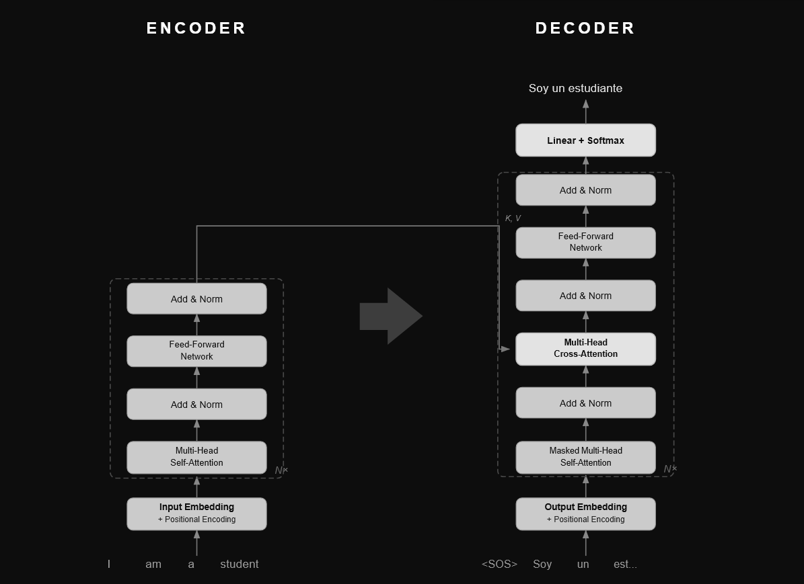

# Neural Linguistic Suite

A production-ready, cloud-first API for multilingual translation and abstractive text summarization. By routing all inference through the Hugging Face Inference API, the system delivers production-quality results with zero local GPU overhead.

---

## Theoretical Foundations
**Transformer Architecture: Core Concepts of Parallel Sequence Modeling**

### What is a Transformer?
A neural network architecture that relies entirely on Self-Attention mechanisms to model global dependencies between tokens. Unlike recurrent models, Transformers process entire sequences in parallel — dramatically increasing throughput and contextual depth.



### Self-Attention
The mechanism that allows every token in a sequence to attend to every other token simultaneously. Attention scores are computed as scaled dot-products of Query, Key, and Value projections, capturing rich linguistic relationships regardless of distance in the sequence.

### Multi-Head Attention
Rather than computing a single attention function, multiple heads run in parallel across independent representation subspaces. Each head can specialize in different aspects of language — syntax, semantics, coreference — and their outputs are concatenated and projected.

### Positional Encoding
Since self-attention is permutation-invariant, positional encodings inject sequence-order information into the embeddings. Sinusoidal functions of varying frequency allow the model to generalize to sequence lengths unseen during training.

---

## Implementation Details

### Tokenization Strategy
*   **Translation (MarianMT):** Utilizes SentencePiece to segment text into subword units, enabling the model to handle rare and out-of-vocabulary words gracefully across English, Hindi, and Spanish.
*   **Summarization (DistilBART):** Utilizes a Byte-Pair Encoding (BPE) vocabulary of 50,265 tokens.

### Core Architecture Flow
The backend utilizes an autoregressive Encoder-Decoder processing pipeline with Beam Search to explore multiple sequence probabilities simultaneously, ensuring high-quality output.

```python
# Autoregressive Decoding Pipeline
for step in range(max_len):
    memory = Encoder(source_tokens)
    logits = Decoder(generated_so_far, memory)
    
    # Beam Search optimization
    candidates = TopK(logits, k=beam_size) 
    next_token = argmax(score + log_prob)
    
    if next_token == EOS: 
        break
```

---

## Key Configuration & Updates

> [!IMPORTANT]
> **Hugging Face API URL Transition**
> This project initially encountered authentication issues (`500/503 errors`) because the old Hugging Face API URL, `api-inference.huggingface.co`, has been deprecated for router access. The backend was updated to correctly use the new `router.huggingface.co/hf-inference` endpoint, restoring reliable model inference. The API key must also be correctly configured on Render as an environment variable named `HF_TOKEN`.

---

## Installation & Local Setup

### 1. Clone the repository
```bash
git clone https://github.com/your-username/neural-linguistic-suite.git
cd neural-linguistic-suite
```

### 2. Create and activate virtual environment
```bash
python -m venv .venv
# Windows
.venv\Scripts\activate
# Mac/Linux
source .venv/bin/activate
```

### 3. Install dependencies
```bash
pip install -r requirements.txt
```

### 4. Create a .env file and add your token (optional for local dev)
```bash
# create .env
# echo "HF_TOKEN=hf_your_actual_token_here" > .env
```

## Run Locally

### Start the backend server
```bash
uvicorn backend.main:app --reload
```

---

## Production Deployment (Render)

To deploy to Render, you **MUST** configure the environment variable:
1.  Go to your Render dashboard.
2.  Open your API service.
3.  Go to the **Environment** tab.
4.  Add a new key: `HF_TOKEN`.
5.  Set its value to your Hugging Face API key (`hf_...`).
6.  **SAVE CHANGES.**

---

## Live Demo

https://github.com/user-attachments/assets/9f0a9154-0a2b-4d7c-a2b4-c393a9db3a38
